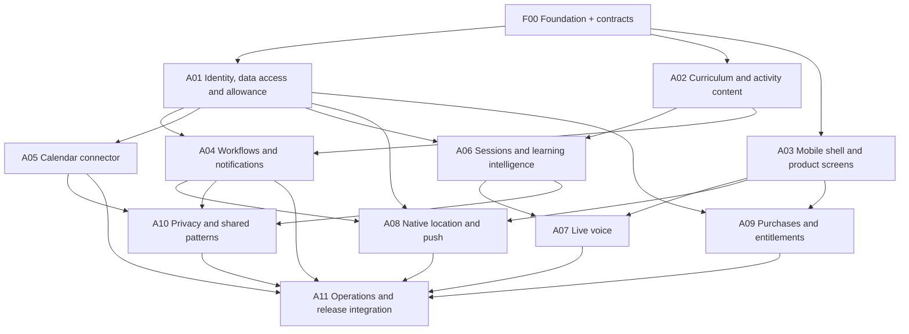

# Agent build plan and handoff prompts

Updated September 19, 2026 · Companion to [Technical design specification](./technical-design-plan.md)

**Start here:** appoint one integration owner, run F00, then launch packages whose dependencies are satisfied. Do not launch a separate agent for every screen or every AI role. The product's learning agents are application responsibilities; the coding agents below are temporary implementation workers.

This packet does not start agents, provision accounts, or deploy software. It is ready to copy into your own build sessions.

**Reuse decisions:** read the [package-by-package build-versus-reuse review](./build-vs-buy-review.md) before dispatch. Packages describe responsibilities, not infrastructure to invent. Reuse the selected libraries/services; add only application-specific behavior. Nango is a candidate behind gate C1, not an active second connector implementation.

## 1. Integration rules

- One Git repository; one worktree/branch per contributor. Use codex/<package-id>-<purpose> branches unless you choose a different convention.
- Integration owner owns packages/contracts, root build configuration and lockfile, migrations, route/job registration, and deployment changes. Module owners submit changes to these paths as explicit integration requests.
- Read the design before implementation. Search existing helpers/callers before adding a new one.
- Follow each package's reuse boundary. No custom auth system, queue engine, media relay, generic UI kit, purchase backend or monitoring platform. Vendor configuration still needs authorization, integration and acceptance evidence.
- Do not change shared types locally to make a module compile. Propose the smallest contract change, with affected consumers and migration implications.
- Commit runnable slices. Provider doubles are allowed for development tests and must be visibly labeled; they do not satisfy real Calendar, location, voice, or billing gates.
- Never replace a failed integration with fake success or mark native functionality verified from a simulator alone.
- No production infrastructure purchase/deployment, app-store submission, payment transaction, public launch, or outbound messages solely because this document describes them. Obtain the applicable user authorization when execution reaches those actions.
- Contributor completion includes code, relevant tests, exact checks/results, contract changes, observed limitations, and a concise handoff. A passing isolated unit test is not end-to-end completion.

Use at most three implementation contributors alongside the integration owner initially. Increase parallel work only when boundaries remain clear.

## 2. Dependency map



A04 and A06 can develop concurrently against F00's typed AI-plan contract. The integrated autonomous demonstration requires both, plus A05 and the mobile app. A07 additionally requires F00's actual voice-control probe. Privacy controls and consent are foundational in A01; A10 finishes export/deletion and cross-user eligibility before a pilot.

**Suggested dispatch waves:**
1. F00 alone until contract gate is published. Independent provider account setup can happen alongside it.
2. A01, A02, A03 in parallel.
3. A04, A05, A06 in parallel.
4. A07, A08, A09 in parallel.
5. A10 plus A11 preparation; final A11 integration after all required packages land.

This ordering optimizes integration clarity, not a promised calendar duration. The earlier 12-week estimate remains a planning estimate, not something more agents automatically eliminate.

## 3. Work packages

### F00 — Foundation, contracts and feasibility proofs

**Owner:** integration lead. **Dependencies:** planning documents and founder's local toolchain; provider credentials only for live probes.

**Own:** workspace/root files, packages/contracts, initial db/migrations, backend/mobile bootstraps, CI, docs decisions.

**Deliver:**
- Create the application repository outside sources; copy the root planning Markdown documents into docs as a set so their relative links remain valid. Research extracts may be copied as reference material if offline source access is needed; never modify the synced sources directory.
- Pin Node/pnpm, compatible Expo/native versions, TypeScript, Fastify, Zod, pg, migrations, pg-boss and testing dependencies. Commit one lockfile.
- Configure Expo EAS for development builds and later authorized submission; pin React Native Paper and RevenueCat UI compatibility with the native stack. Reuse CI tooling rather than creating build/signing services.
- Prepare connector gate C1 from the build-versus-reuse review. Prefer a bounded Nango auth/proxy proof before writing custom Calendar credential infrastructure; test accounts are required for live evidence. Publish one connector decision before production A05 implementation. If Nango is adopted, coherently update schema/routes/jobs/secrets/deletion contracts and remove replaced direct integration work. Otherwise retain the direct Google baseline. Do not maintain both paths.
- Create API and worker entry points, mobile shell, local database/auth setup, environment example with names only, and health endpoints.
- Define Zod schemas, enums and fixtures for the specification's API, events, plans, results and tool contracts; generate OpenAPI. Mobile/backend import these types.
- Create only the foundational tables and migration workflow. Later package migrations are reviewed/numbered by this owner.
- Implement and prove atomic domain-write + enqueue using the pinned pg-boss transaction-bound db API and existing pg transaction client. Kill the process between steps to prove no lost committed work. A missing compatible API is a concrete dependency issue for the integrator to resolve, not permission for a non-atomic dual write.
- On a physical iPhone, prove a signed development build, native geofence event, and notification/deep link.
- Prove one Realtime WebRTC call with backend sideband and server hangup. Capture model availability, actual native package compatibility, interruption behavior and cost; no real-user private content.
- Publish F00 contract gate with exact commands and fixtures. Account-dependent native probes remain visibly open until actually run; they block dependent launch gates, not unrelated content/UI work.

**Acceptance:** clean install/build; API+worker boot; database migration reset; generated-contract check passes; owner-isolated fixture IDs; durable enqueue proof. Record native/voice proof status separately.

### A01 — Identity, data boundaries and allowance foundation

**Dependencies:** F00 contract gate.

**Own:** backend identity module, db owner-bound helpers, common authorization/idempotency middleware, billing usage reservation functions. Propose migrations through integrator.

**Reuse:** Supabase Auth for identity and token lifecycle; Postgres RLS/constraints for data boundaries. Build application authorization, consent and usage accounting. Do not implement password/OTP/session-issuance infrastructure.

**Deliver:** verified Supabase identity, learner/profile/consents/devices, RLS setup, stable ownership, bootstrap/progress shells, idempotency records, usage_accounts/ledger transaction functions, one-active-session invariant, administrative learner disabling and immediate revocation hooks. API clients must never select their own userId.

**Acceptance:** T01 and accounting portion of T02; 30 simultaneous reservation requests cannot overspend or create parallel active sessions; reused key/different body conflicts; pooled connections cannot leak the prior request's user context.

**Handoff:** auth context type, repository transaction helper, reserve/finalize/release signatures, consent/revocation query API and test fixtures.

### A02 — Curriculum, rubrics and activity structures

**Dependencies:** F00.

**Own:** content/spanish and content validation/import tooling. No independent mobile or backend architecture edits.

**Reuse:** versioned JSON in Git, existing schema validation and properly licensed assets. Build curriculum/rubrics and record expert review. No CMS or assessment-authoring platform for 25 nodes; Learnosity is a deferred alternative.

**Deliver:** 25 functional skill IDs, five milestones, 25 curriculum nodes; reviewed-template schema; initial activity formats; prerequisites, answer variation, assistance, correction and alternate-context versions. Bundle or license listening assets properly. Mark all AI-authored content unreviewed until a competent reviewer approves it.

**Acceptance:** content schema and all referenced IDs validate; prerequisite graph has no cycle; every node has rubric and transfer/fallback behavior; seed data repeats safely. At least the pilot subset has recorded human review before pilot use.

**Handoff:** stable content version, manifest, fixtures covering beginner difficulty and unclear speech, reviewer checklist. Do not claim AI-generated content has been teacher reviewed.

### A03 — Mobile shell and product screens

**Dependencies:** F00; integrate live identity when A01 lands.

**Own:** mobile routes, feature screens except native/voice/purchases internals, UI components, typed API query hooks.

**Reuse:** Expo Router, React Native Paper and TanStack Query. Theme/compose standard controls; build the learning-specific screens and audio interactions. A09 supplies RevenueCat's paywall UI. Verify accessibility in the assembled app.

**Deliver:** onboarding and sign-in, Learn path, opportunities, Connect apps UI, progress, feedback, privacy/settings, subscription screen shell. Integrate ordinary text practice once A06 lands. Implement accessibility, loading/empty/error/offline states, time zone/quiet-hour settings and explicit remaining allowance.

**Acceptance:** app builds on physical iPhone; navigation and deep links work; VoiceOver and Dynamic Type smoke checks; UI consumes shared fixtures without duplicating domain rules; real signup/lesson path works before package is finally accepted.

**Handoff:** screen/route map, design tokens, native-module integration points, screenshot set and Maestro smoke path.

### A04 — Workflow runtime, opportunity pool and notifications

**Dependencies:** A01, A02. Uses F00's planner contract; integrates real planner from A06.

**Own:** workflows, notifications and backend signals ingestion/normalization modules; worker handlers for these queues.

**Reuse:** pg-boss scheduling/retries/recovery and Expo Push delivery. Build only business states, eligibility/cancellation and external-delivery bookkeeping. Do not add Trigger.dev/Inngest alongside pg-boss or duplicate its queue machinery.

**Deliver:** versioned runs/steps; context_practice_v1, review_v1 and ordinary-practice transitions; delayed work and recovery; owner-bound device event endpoint; source dedupe; coalescing; quiet hours/DST/cooldown/daily limits; outbox delivery; receipt reconciliation; stale-context rules and why-this-appeared reasons. Calendar and location adapters call this module's ingestion function.

**Acceptance:** T04/T05; fake-clock tests for waits and DST; replay signal without duplicate offer; cancel during generation and discard late output; worker restart resumes; no DB transaction held across external calls. Demonstrate ordinary due review when no external signal exists.

**Handoff:** ingestContextEvent signature, enqueue/resume API, planner input/output contract consumer, cancellation hooks, job registry changes and trace reason codes.

### A05 — Google Calendar connector

**Dependencies:** A01 and F00's event contract; integrate A04 ingestion before acceptance.

**Own:** connectors/google, Google callback/webhook routes, calendar sync/watch jobs.

**Reuse:** follow F00's C1 connector decision. Current specification is direct Google using maintained provider libraries; Nango auth/proxy is the first replacement to validate. Nango-managed sync is optional only after equivalent behavior and minimal-field tests pass. If Nango is selected, its credentials replace the app's Google token vault, and any adopted sync jobs replace their local counterparts. Provider/account/resource authorization always stays in the application.

**Deliver:** integrate the chosen OAuth/credential lifecycle, resource selection, full/incremental sync, recurrence/window expansion, cursor recovery, watch renewal, periodic reconciliation, cancellation, reconnect/disconnect, scoped current-event lookup. Bind every provider record to the correct owner and account. Nango adoption requires a revised ownership/contract record; its template is not proof that these behaviors work.

**Acceptance:** T03 plus Calendar portion of T01/T06/T11; real test account proves event create/edit/cancel without manually opening the learning app. Demonstrate seven-day horizon refresh and recurrence exception handling. Preserve provider restrictions as enforceable lineage.

**Handoff:** required scopes/redirects, provider setup instructions, permission/verification status, native callback behavior, field-level data contract and real integration evidence. Provider approval pending is recorded honestly.

### A06 — Sessions, learning intelligence and evidence

**Dependencies:** A01, A02.

**Own:** learning and ai modules, reviewed prompt versions, model schemas/tools, session SSE/text routes, evidence/review logic.

**Reuse:** hosted OpenAI models, SDK and Zod validation. Build learning decisions, evidence and context policy as ordinary functions. No custom model hosting, agent framework or separate service per AI role.

**Deliver:** session start/resume/finish against A01 accounting; context interpreter/planner; text tutor; assessment/reflection; role-specific context builders returning lineage; deterministic XP and skill projections; reviewed-example tool. Wire scheduling through A04's published API when available.

**Acceptance:** T06/T08; schema/ID validation rejects invented skill/context IDs; uncertain/assisted results do not produce unassisted mastery; duplicate finish/assessment does not add evidence or XP twice; selected examples differ appropriately for two learners. Actual model benchmark documented separately from offline tests.

**Handoff:** plan/assessment fixtures, context limits, session callbacks for voice, allowed tool dispatcher, evaluation results and review schedule semantics. Never add arbitrary calendar-write or URL-fetch tools.

### A07 — Native voice and server control

**Dependencies:** A03, A06, F00's successful physical voice-control probe.

**Own:** mobile native/voice and practice voice UI; backend voice module and watchdog jobs.

**Reuse:** OpenAI Realtime with native WebRTC; do not build a media relay. Keep app-owned session budget and authoritative server controls. LiveKit is a replacement candidate only if a documented voice-probe result justifies the additional runtime.

**Deliver:** WebRTC audio, SDP API handshake, trusted call binding, sideband control, captions, barge-in, audio routing, pause/resume, network recovery, server hangup, persisted deadline/controller lease, usage capture and final transcript dedupe. Both control and media paths must recover.

**Acceptance:** T07/T12 voice cases; server stops a call with mobile controls deliberately ignored; API process loss triggers watchdog cleanup; reconnect never doubles call count or resets allowance; app backgrounding ends media; no permanent provider secret in mobile bundle/logs.

**Handoff:** actual device/OS/package matrix, measured response latency/cost, audio-failure handling, unknown-finalization recovery and media-epoch contract.

### A08 — Native location and push integration

**Dependencies:** A03, A04; A01 device registration.

**Own:** mobile native/geofences and native/push, region permission UX, curated region data validation.

**Reuse:** Expo Location/TaskManager/Notifications and native Core Location/APNs. Build region selection, account-safe event handling and policy. Radar is deferred; it adds server-side location processing that ten curated regions do not currently require.

**Deliver:** top-level background task, permission ladder, region registration/versioning, account-safe queued events, expiry handling, logout cleanup, notification receipt/deep link, app-launch/reboot state recovery. Integrate server-provided regions; do not continuously upload routes.

**Acceptance:** R03/T12 location cases on physical device; foreground/background/locked/denied/offline tests; replayed/expired event does not notify; account switch cannot submit prior user's event. Explain observed force-termination/OS restrictions.

**Handoff:** reproducible field-test route, tested region configuration, build permission declarations, actual event/delivery timestamps and unsupported states.

### A09 — Subscription purchase and entitlement integration

**Dependencies:** A01 accounting, A03 screens.

**Own:** backend billing provider/reconciliation routes and mobile native/purchases; use existing reservation functions unchanged.

**Reuse:** RevenueCat purchase/restore SDK and RevenueCat Paywalls via react-native-purchases-ui. Configure offerings and localized disclosures; retain app-owned free-session/paid-duration accounting. Do not build a generic paywall renderer or subscription backend.

**Deliver:** identified RevenueCat/StoreKit purchase and restore, one monthly product/entitlement, localized offering UI, verified webhook ingestion and subscriber reconciliation, environment separation, expiry/refund/revocation, stale entitlement recovery and paid duration accounting.

**Acceptance:** T02 paid cases/T10; sandbox purchase and restore on another device for the same account; forged/duplicate/reordered events fail safely; different-account restore cannot silently steal an entitlement. Server errors never become permanent paid access.

**Handoff:** product/entitlement config, webhook setup, restore policy, sandbox evidence, cost-derived paid allowance and outstanding public pricing decisions.

### A10 — Privacy completion and automatic shared patterns

**Dependencies:** A04, A05, A06.

**Own:** privacy and patterns modules, extraction/review jobs; contributes corresponding mobile settings wiring through A03 owner.

**Reuse:** provider deletion APIs and existing durable jobs. Build provenance, deletion ordering and cross-user eligibility. Transcend is deferred; it cannot replace the application's ancestry rules.

**Deliver:** source-lineage invalidation, resumable source/account cleanup, export, retention sweeps, active-call/job shutdown, restricted-ancestry gate, eligible extraction, generic pattern validation and review, same-user private adaptation versus cross-user catalog separation.

**Acceptance:** T09/T11; seed restricted ancestry through a summarized skill record and prove it still cannot enter extraction; deleting during work discards late output; a second user can use an approved generic pattern without private source details. Record backup and processor-deletion behavior accurately.

**Handoff:** deletion/export runbook, retention configuration, eligibility test matrix, candidate review contract and seed catalog.

### A11 — Operations, end-to-end integration and release readiness

**Dependencies:** all relevant packages; preparation may run earlier.

**Owner:** integration lead, with bounded QA contributions if you authorize them.

**Own:** operations module, final migrations/registration, infra, docs/runbooks, tests/integration and tests/e2e.

**Reuse:** service dashboards, Sentry, existing CI and Expo EAS. Build only missing domain views/actions over audited admin endpoints. Keep replay off and redact private content. Retool can replace the small operations UI if it saves work; it must not bypass backend permissions.

**Deliver:** restricted run/connector/cost/quality views, review actions and kill switches; production-ready environment templates; CI checks; dependency/contract integration; onboarding-to-review test; cancellation/revocation/recovery test; purchase test; backup restore and rollback evidence. Remove unlabeled development fixtures and accidental secret/raw-content logging.

**Acceptance:** every release-contract row has linked evidence and every required test is green or an explicit unresolved blocker. Final report separates implemented, locally tested, provider-tested, physically tested and externally approved.

**Handoff:** TestFlight installation instructions when distribution is authorized, release checklist, known limitations, operating costs, incident/deletion/rollback runbooks, and first real autonomous end-to-end demonstration.

## 4. Definition of done for each agent

Include this in each completion message:

```text
Package:
Commit / branch:
Implemented behavior:
Reused platforms/libraries and configuration:
Application-specific logic added:
Owned files changed:
Shared-contract or migration changes requested:
Checks run and results:
Real provider / physical-device evidence:
Remaining blockers or unsupported behavior:
Next package integration instructions:
```

Required quality is proportional to the package. UI polish does not require redundant implementation-mirroring tests; billing, authorization, concurrency, deletion and workflow recovery require executable invariant checks.

Before merging, integration owner reads the diff, regenerates contracts, runs the smallest cross-module tests the change affects, applies migrations to a clean/staging database, and confirms no required behavior was silently removed.

## 5. Copyable coordinator prompt

Place the supplied technical-design-plan.md, agent-build-plan.md and technical-architecture.md in the new repository's docs directory before using this prompt, or attach those files and give the coordinator their actual paths. The contributor prompts assume F00 has completed that copy.

Include build-vs-buy-review.md in the same set; it supplies the reuse boundaries and C1 connector gate.

```text
Implement the personal learning orchestrator described in docs/technical-design-plan.md.
Use docs/agent-build-plan.md as the package/dependency plan and
docs/technical-architecture.md as the system map.
Follow docs/build-vs-buy-review.md for reuse decisions; do not reinvent the
selected platforms. Resolve C1 before production Calendar implementation.

Start with F00. Inspect the repository and applicable AGENTS.md before editing.
Treat synced sources as read-only. Create the application in the chosen application
repository, not in sources. Preserve existing work.

Own contracts, root configuration, lockfile, migration order, registration and
integration. Freeze Zod contracts and publish fixtures before independent modules
diverge. Use the specified stack and keep one API, one worker and one database.

After the F00 contract gate, work through dependency-ready packages. If I have
authorized parallel coding agents, give each one an isolated branch/worktree and
an explicit package/path boundary. Keep at most three contributors active initially.

Require the package handoff format and meaningful tests. Integrate actual provider
paths before claiming end-to-end completion. Never label a simulated signal as a
real Calendar/location integration, or a mocked call as verified voice.

Continue local/reversible implementation autonomously. Do not invent credentials,
company information, provider approvals, native test results, or review sign-offs.
Record real external blockers and continue independent work. Ask for material
missing input only when it blocks the next dependent action. Do not purchase
infrastructure or publish/deploy externally without applicable authorization.

Deliver implementation, checks, known limitations, and a release-contract evidence
matrix. A diagram or collection of disconnected modules is not completion.
```

## 6. Copyable contributor prompt

```text
Implement package <ID> from docs/agent-build-plan.md.

Read docs/technical-design-plan.md, the package section, relevant existing code,
and applicable AGENTS.md. Verify predecessor contracts are present before coding.
You own only the paths specified for this package. Reuse shared types and helpers.
Read docs/build-vs-buy-review.md and follow the package's reuse boundary. A listed
alternative is not permission to add another platform or duplicate a runtime.

Do not independently change packages/contracts, root dependencies/lockfile,
migration ordering, route/job registration, or another package's code. Send the
integration owner a concrete change request when those are needed.

Implement real behavior and the package's acceptance checks. Use labeled provider
doubles only for local tests; record live/native validation separately. Preserve
permission, provenance, idempotency, accounting and cancellation invariants.

Do not add speculative platform abstractions. Do not spawn more agents unless
explicitly authorized. Do not publish, deploy or contact third parties without
applicable authorization.

Finish using the handoff format in the agent plan. Include exact checks/results,
shared changes needed and real blockers. Do not claim success for unrun tests.
```

Replace <ID> with exactly one package, such as A05. Supply the selected application repository/worktree as the coding agent's working directory.

## 7. Founder setup checklist

These inputs are not needed to begin contracts, local code and tests. They are required at the named real integration/release gates.

| Input | Needed by | Agent can prepare first |
|---|---|---|
| Chosen app repository, product/bundle identifier, Apple team and physical iPhone | F00 native proof | Repository, local builds and configuration template |
| Supabase staging project and identity settings | A01 live authentication | Local auth, JWT verification tests and schema |
| Google OAuth project, registered redirect and selected test accounts | A05 live Calendar proof | Callback/sync code and provider-contract tests |
| Nango test configuration, if evaluating C1 | F00/A05 connector decision | Gate tests and data/ownership comparison; no second production implementation |
| OpenAI project with funded access and model availability | F00 voice proof / A06 / A07 | Interfaces, output validation and deterministic test fixtures |
| Launch area and permitted curated public venue data | A08 physical opportunity test | Region schema and clearly labeled developer test regions |
| Spanish content reviewer | A02 pilot gate | Versioned drafts, rubrics and review workflow |
| Render/Supabase hosting authorization and secrets | Staging deployment | Dockerfile, blueprint, environment validation and runbook |
| App Store product, RevenueCat mapping, restore policy and actual price | A09 paid release | Sandbox configuration instructions, verified entitlement code |
| Legal operator identity, privacy/terms/support details | Public release | Draft disclosure screens and retention/export/delete implementation |

Keep secrets in provider/environment secret storage. Never paste them into agent prompts, documentation, Git or screenshot evidence.
