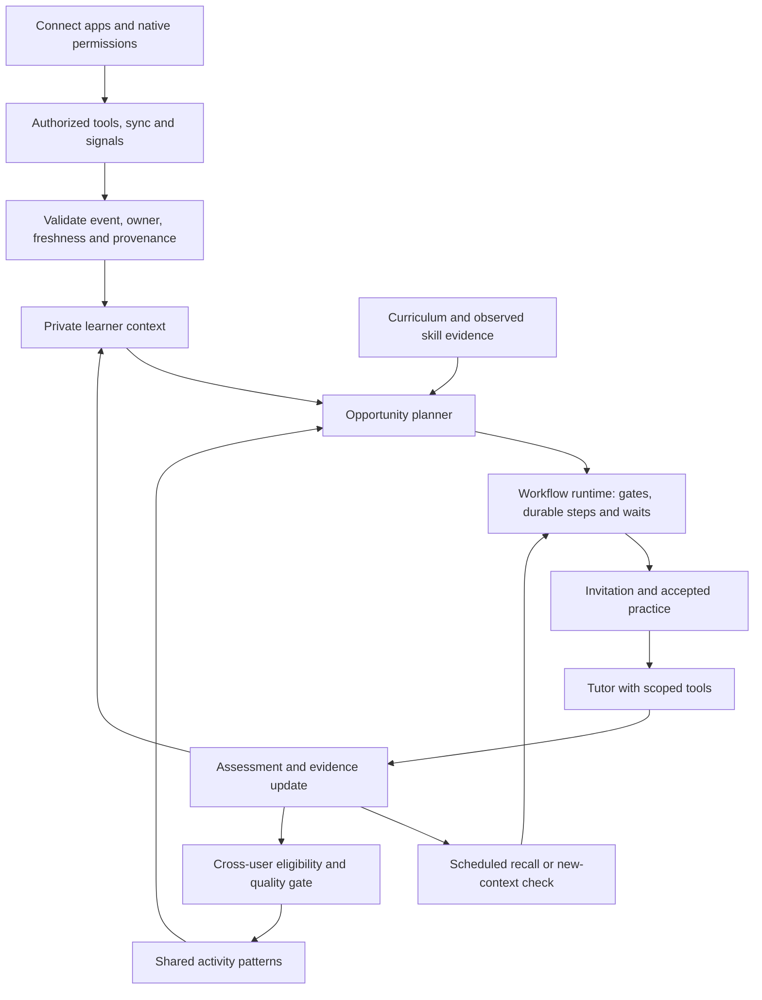

# Connectors and AI orchestration: research and implementation decisions

September 18, 2026 · Personal learning orchestrator · Solo developer · iOS first

## Finding

The product should combine a ChatGPT-style connection experience, HappyRobot-style workflow execution and shared context, and a learning-specific feedback system. A learner connects permitted sources once; the application discovers opportunities, coordinates practice across time, records what was demonstrated, and changes subsequent practice.

HappyRobot is a relevant architectural precedent. Its public materials describe integrations, event triggers, agents that use tools during conversations, persistent structured context, reusable workflows, runs, versioning, and evaluation. They support the feasibility of this pattern in enterprise operations. They do not establish consumer demand, reliable access to every mobile activity, or improved language retention.

This report reviewed 19 additional primary documentation and vendor pages. Source extracts are saved below. HappyRobot's capabilities and customer outcomes are vendor-reported; no paid platform, internal implementation, or live integration was tested. Implementation recommendations are our design, not claims about either company's private architecture.

## 1. What to borrow from ChatGPT connectors

OpenAI's current documentation uses apps, plugins, and MCP servers across different surfaces. The enduring product pattern is a connection between a person's account, an external service, permitted resources, and specific capabilities. Enabling an integration and authorizing access to the upstream service are separate steps. Some connections support retrieval, some indexing/sync, and some actions. Availability varies. [C01]

For this application, build a **Connect apps** screen:

- Show the benefit before authorization: “Use upcoming plans to prepare relevant Spanish practice.”
- Connect a specific account and let the learner select supported resources.
- Display what the app can read, what events it can detect, and whether it can change anything.
- Show connection health, last successful sync, and reconnect/disconnect controls.
- Separate account access from proactive-intervention preferences: quiet hours, categories, frequency, and pause.
- Explain each invitation using permitted context, with a correction/dismiss option.

Connecting Calendar should not imply access to music, email, or other apps. A connected service should not appear operational if its event subscription expired.

OpenAI recommends designing tools around useful outcomes, with explicit inputs, structured outputs, authorization, side effects, and failure behavior. Read and write capabilities should be separated. Tool annotations help the model choose; the server still enforces authorization. [C02, C03, C05]

For example, expose a bounded “get upcoming events from selected calendars” operation to an authorized planning step. The server supplies the connection owner and resource restrictions. The model cannot select another learner's account.

### Three capabilities that must remain distinct

| Capability | What it provides | Example |
|---|---|---|
| Tool access | A request made when a workflow needs information or an action | Retrieve the current time/status of an event |
| Sync/index | A maintained local view of selected source data | Upcoming events with IDs, versions, cancellation state, and freshness |
| Trigger delivery | An event that starts or resumes work | Calendar change, geofence entry, or a scheduled preparation time |

A connection may provide only some of these. Calendar change notifications indicate that synchronization is needed; your scheduler handles “30 minutes before the event.” A webhook and a clock solve different problems. [S12, S13]

MCP is useful for standardizing access to tools and resources. Current MCP documentation also describes notification subscriptions, so “MCP cannot deliver events” would be inaccurate. Subscription support depends on the server/client and protocol version. It does not create an upstream playback signal, maintain your workflow state, or guarantee delivery to a suspended phone. [C04, C19]

Implement the two initial sources directly where that is simplest. Use an existing compatible MCP server only when its authorization, data terms, and capabilities fit. Building an MCP server is not required to have a ChatGPT-like connection experience. Your product must obtain its own provider access; it does not inherit ChatGPT's integrations or users' existing grants.

## 2. What HappyRobot contributes

| Documented pattern | What HappyRobot describes | Translation to learning |
|---|---|---|
| Scoped integrations | Workflow-specific reads/actions and isolated credentials; preload, live lookup, webhook entry | Each learning step receives only the sources/tools it needs |
| Triggered workflows | Webhooks, schedules, calls, messages, and other inputs | External changes and due reviews initiate work without a manual check-in |
| Agentic and deterministic steps | Conversational reasoning alongside exact branches, validation, and API operations | AI interprets and teaches; code controls permissions, timing, usage, and transitions |
| Persistent context | Entity-linked structured outcomes, attributes, and memory across interactions | A learner's skill evidence, uncertainty, preferences, and pending opportunities |
| Tool use and handoffs | Lookup/actions during execution, passing context, waiting, and continuing | Tutor requests a suitable example; assessment hands evidence to future planning |
| Workflow definitions and runs | Versioned reusable logic, separate execution histories and environments | One reviewed workflow executes independently for many learners |
| Interfaces and evaluation | Operational views, run traces, testing, AI/human audits | Learner experience plus founder diagnostics and teacher-reviewed assessment |

Sources: C07–C15.

The strongest enterprise example is HappyRobot's DHL story: a temperature sensor breach initiates agent contact and escalation. The general pattern is external signal → relevant context → action → recorded outcome. Its WWEX story describes six agents assigned to stages in a shipment lifecycle. These are useful precedents for decomposing a real process into responsibilities. Reported throughput or ROI does not predict learning-app performance. [C16, C17]

HappyRobot's technical overview also describes mobile/web voice through WebRTC, queue workers, and auditing of tool selection, latency, interruptions, and outcomes. These are relevant capabilities. Its Kubernetes estate, SIP infrastructure, proprietary voice models, and enterprise deployment controls are not requirements for this MVP. [C06]

## 3. The proposed AI workflow

Use one persistent learning process per learner, activated by events and timers. It can remain idle while preserving state; it does not require a continuously running model.

Use four bounded AI roles in the same backend:

1. **Context interpreter:** turn authorized facts into possible situations, with uncertainty and expiry. “Upcoming dinner” is supported by an event; “Maya attended and spoke Spanish” is not.
2. **Learning planner:** combine the situation, curriculum, due reviews, and effort history into an opportunity. Select or adapt reviewed activity structures and place them in the learner's private pool.
3. **Tutor:** conduct accepted speaking/listening practice. Choose among permitted tools and teaching strategies during the session, within time and difficulty bounds.
4. **Assessment/reflection:** record demonstrated responses, assistance, and uncertainty; propose the next check and eligible pattern candidates.

The orchestrator coordinates these roles and the intervening tools, timers, and user actions. It validates model proposals before committing them. This is a multi-role workflow within one application; independent services or freely conversing agent swarms are unnecessary.

The normal curriculum and contextual workflows update the same skill record. Otherwise they become two disconnected products: a lesson app and a notification generator.

### Maya's day: illustrative execution

1. Maya has started Spanish and connected a selected calendar. Her stored evidence shows that she can make a polite request but needs help understanding quantities.
2. Calendar sync finds a future dinner plan. A versioned preparation workflow creates a run associated with Maya and that event. It stores a timed wait before the relevant window.
3. When the wait ends, the runtime rechecks the event, consent, freshness, quiet hours, and prompt budget. The planner selects a short listening-and-response activity about quantities.
4. The app offers the activity. Maya did not need to declare the dinner or ask for a lesson. Live microphone use begins when she accepts.
5. During practice, Maya struggles with a number. The tutor can request a simpler reviewed listening example and then return to the original objective.
6. Assessment records that she understood the quantity after a replay. Completing the session does not mark unassisted mastery.
7. A linked review run becomes due later. If a suitable permitted context appears, it adapts the check to that context; otherwise it offers an ordinary review.
8. If the dinner is canceled, pending dinner-specific work is canceled or superseded. If Maya ignores the offer, her language skill is not marked down.

A future permitted music connector can use the same execution model: activity signal → learner context → appropriately timed listening opportunity → assessment. Whether it can observe playback and whether the data can be used for AI are separate provider-specific questions. The architecture supports that vision without pretending the integration is already available.

## 4. Persistent execution: the implementation that makes autonomy real

Keep workflow definitions as versioned code and reviewed prompts. Store each run in Postgres with owner, definition version, trigger reference, current step, pending wait, input lineage, result references, and cancellation reason. A due job claims a step, performs bounded work, commits the result, and schedules the next step.

A practical run lifecycle is:

`pending → running → waiting → running → completed`

Terminal alternatives are canceled, expired, superseded, or failed. Retryable failures use a bounded retry time. Waiting has a reason such as a scheduled time, learner response, or external result; no model connection remains open for an overnight wait.

Keep runs separate from opportunities and sessions. An opportunity is a candidate learning experience. A run coordinates its preparation and delivery. A session records an actual interaction. A follow-up run links to earlier evidence.

Minimum invariants:

- Every tool call is bound server-side to the learner, active connection, allowed resources, and current grant.
- External text is data, including event titles containing instructions.
- Repeated events and retried steps use stable IDs; database constraints prevent duplicate evidence and allowance consumption.
- Job leases expire safely; concurrent workers cannot commit conflicting run transitions.
- External sends use an outbox and stable IDs where supported. Recovery does not promise universal exactly-once notification delivery.
- Late tool/model results cannot revive canceled or superseded work.
- Revocation cancels pending source-derived steps and blocks later tool calls; deletion follows data lineage.
- Gates run again after waits. Authorization or context valid yesterday may be invalid today.
- Model calls, tool calls, retries, session duration, and proactive invitations have enforceable budgets.

Start with the existing API, worker, database, and durable queue. Reconsider a dedicated orchestration service when operational evidence shows that maintaining timers, histories, retries, or recovery is becoming the larger burden. A graphical workflow editor is not needed to prove autonomous learning.

## 5. Two different forms of shared learning

**Within one learner's account**, authorized roles share structured private context. Planner, tutor, and assessment can build on previous work without Maya restating it. Access remains limited by purpose and source permissions.

**Across learners**, the shared pool contains eligible generic activity structures and permitted aggregate evidence. Agents maintain it automatically; learners do not publish activities. Start with reviewed templates so the product works before a community exists.

Carry source lineage through summaries, generated exercises, and outcomes. For the pilot, exclude restricted connector-derived sessions from shared extraction. Google's Workspace policy restricts use beyond the specific user's permitted experience; removing names or obtaining general consent does not automatically make derivatives eligible. Use separately eligible first-party practice and system-authored generic patterns. [S15]

“Learning continuously” initially means updating private records, scheduling, selection, and reviewed pattern evidence. It does not require online foundation-model training or automatically publishing every generated activity.

## 6. Connector build decisions

| Source | Initial implementation | Trigger reality | Decision |
|---|---|---|---|
| Google Calendar | Per-user OAuth; selected calendars; read-only sync and lookup | Change notification → reconciliation; event time → your timer | Commit; prove real access and verification requirements |
| iOS location | Native permission and bounded geofences | OS region events with lifecycle/delivery limits | Commit; verify on physical devices |
| Curriculum and practice | First-party records | Session outcomes and due reviews | Commit; works without external accounts |
| Music service | Provider-specific authorization and capability review | Playback signal availability and permission are unproven for the intended product | Gated feasibility work |
| Food apps | Consumer account API/partner review | Merchant APIs do not establish access to consumer order history | Defer until actual access exists |

Prior primary-source research supports the Calendar, location, Spotify, and food-app distinctions. [S12–S22] iOS does not become a general cross-app observer through React Native or MCP. Background behavior and app-review acceptance remain real-device and distribution gates.

For the solo founder, a managed connection service can reduce OAuth credential-lifecycle work. Nango documents an embedded connection flow, encrypted credential storage, refresh, connection IDs, reconnect, and logs. It also states that your application owns the mapping from a connection to its user and normally needs its own provider OAuth app. [C18]

Recommendation: use direct Calendar integration for the initial proof; evaluate Nango before expanding SaaS connectors or if credential operations consume disproportionate time. Check actual mobile flow, pricing, processor terms, and provider support before adopting it. Neither option replaces event reconciliation, learner authorization, or pedagogical planning.

## 7. What changes in the MVP

Keep the iOS-first app, five practical milestones, 25 bounded free sessions, and two committed external context sources. Add explicit implementation ownership for:

1. Connect-apps UX, connection health, resource selection, and separate permissions for access and proactive help.
2. A small documented capability record for each source: reads, writes, sync, events, freshness, restrictions.
3. Versioned workflow definitions and durable per-learner runs with waits, resumption, cancellation, and tool results.
4. One private structured context shared by the learning roles and normal curriculum.
5. A founder run view showing what triggered work, why it acted or stayed quiet, tools used, outcome, latency, and cost.
6. An evaluation set covering context correctness, tool selection, teaching quality, false interruptions, and later unassisted recall.

Measure the learning hypothesis separately from operational reliability. A successfully delivered notification proves delivery. Useful practice requires observed user value; stronger retention requires delayed checks and a credible comparison with ordinary practice.

The first demonstration should span time: connect an account, let a real signal start work while the app is backgrounded, resume through an accepted session, update evidence, and show that a later activity changes. Also demonstrate cancellation, duplicate-event handling, and isolation between two accounts.

The updated [technical roadmap](./technical-roadmap.md) places these pieces in build order.

## 8. Source register

All sources below were retrieved September 18, 2026. Public product documentation can change. Vendor descriptions establish advertised capabilities, not independent performance verification.

- **C01 — ChatGPT connection and plugin controls:** [primary source](https://learn.chatgpt.com/docs/enterprise/apps-and-connectors) · [saved extract](./research/C01-openai-connectors.md)
- **C02 — OpenAI tool design:** [primary source](https://developers.openai.com/plugins/plan/tools) · [saved extract](./research/C02-openai-tools.md)
- **C03 — OpenAI connector authentication:** [primary source](https://developers.openai.com/plugins/build/auth) · [saved extract](./research/C03-openai-auth.md)
- **C04 — OpenAI remote MCP and connectors:** [primary source](https://developers.openai.com/api/docs/guides/tools-connectors-mcp) · [saved extract](./research/C04-openai-mcp-guide.md)
- **C05 — OpenAI connector security and privacy:** [primary source](https://developers.openai.com/plugins/guides/security-privacy) · [saved extract](./research/C05-openai-security.md)
- **C06 — HappyRobot technical overview:** [primary source](https://www.happyrobot.ai/blog/technical-overview) · [saved extract](./research/C06-happy-tech.md)
- **C07 — HappyRobot integrations:** [primary source](https://www.happyrobot.ai/product/agents/integrations) · [saved extract](./research/C07-happy-integrations.md)
- **C08 — HappyRobot agents:** [primary source](https://www.happyrobot.ai/product/agents/agents-overview) · [saved extract](./research/C08-happy-agents.md)
- **C09 — HappyRobot context:** [primary source](https://www.happyrobot.ai/product/context/context-overview) · [saved extract](./research/C09-happy-context.md)
- **C10 — HappyRobot workforce orchestration:** [primary source](https://www.happyrobot.ai/product/workforce-orchestration) · [saved extract](./research/C10-happy-orchestration.md)
- **C11 — HappyRobot hybrid workflows:** [primary source](https://www.happyrobot.ai/blog/the-agentic-and-deterministic-hybrid-enterprises-need) · [saved extract](./research/C11-happy-hybrid.md)
- **C12 — HappyRobot workflow tutorial:** [primary source](https://www.happyrobot.ai/hub/how-to-use-happyrobot-a-step-by-step-tutorial) · [saved extract](./research/C12-happy-tutorial.md)
- **C13 — HappyRobot evaluation and trust:** [primary source](https://www.happyrobot.ai/product/trust) · [saved extract](./research/C13-happy-trust.md)
- **C14 — HappyRobot platform overview:** [primary source](https://www.happyrobot.ai/product/platform-overview) · [saved extract](./research/C14-happy-platform-page.md)
- **C15 — HappyRobot interfaces:** [primary source](https://www.happyrobot.ai/product/interfaces) · [saved extract](./research/C15-happy-interfaces.md)
- **C16 — HappyRobot WWEX case study:** [primary source](https://www.happyrobot.ai/customer-story/wwex) · [saved extract](./research/C16-happy-wwex.md)
- **C17 — HappyRobot DHL case study:** [primary source](https://www.happyrobot.ai/customer-story/dhl) · [saved extract](./research/C17-happy-dhl.md)
- **C18 — Nango authentication guide:** [primary source](https://nango.dev/docs/guides/auth/auth-guide) · [saved extract](./research/C18-nango-auth.md)
- **C19 — MCP subscriptions specification:** [primary source](https://modelcontextprotocol.io/specification/2026-07-28/basic/patterns/subscriptions) · [saved extract](./research/C19-mcp-subscriptions.md)

Earlier platform sources, retrieved September 17, 2026:

- **S12–S13 — Google Calendar notifications and sync:** [push](https://developers.google.com/workspace/calendar/api/guides/push), [sync](https://developers.google.com/workspace/calendar/api/guides/sync).
- **S14–S15 — Google OAuth and data use:** [verification](https://developers.google.com/identity/protocols/oauth2/production-readiness/sensitive-scope-verification), [Workspace data policy](https://developers.google.com/workspace/workspace-api-user-data-developer-policy).
- **S16–S19 — Mobile background signals:** see the [existing source register](./research-brief.md).
- **S20–S21 — Spotify:** [development-mode migration](https://developer.spotify.com/documentation/web-api/tutorials/february-2026-migration-guide), [developer policy](https://developer.spotify.com/policy).
- **S22 — Uber Eats:** [API introduction](https://developer.uber.com/docs/eats/introduction).

Unresolved through public research: exact live signal reliability on target phones, provider approval for the intended music workflow, HappyRobot's suitability and commercial terms for this consumer product, and whether contextual practice improves retention for this audience. These require integration tests, vendor-specific review where needed, and user evidence.

