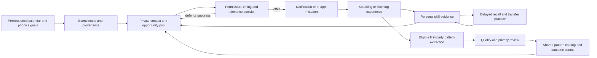

# Experience-led language learning: MVP and startup plan

**Current revision:** solo developer, iOS-first, 25 free interactive sessions across five product milestones. See [Solo-founder launch and company setup](./solo-founder-launch-plan.md) for cloud-credit applications, legal setup, and the detailed free-tier specification.

**Planning baseline:** September 17, 2026. Working scope, ready to turn into implementation tasks. This plan is based on our discussion and 25 reviewed source documents or paper records; the accompanying research brief distinguishes source findings from recommendations. No customer validation or integration testing has yet been performed.

## 1. The decision

Build a mobile language-learning agent that finds opportunities in a learner's everyday life, initiates relevant practice, and connects those experiences into lasting learning.

**The learner does not design workflows, report every activity, or publish opportunities.** After onboarding and permission grants, connected signals and learning outcomes drive the agent. Participation in an offered experience remains voluntary.

The MVP must prove this complete chain:

**Real signal → personal opportunity → appropriate intervention → speaking/listening practice → feedback → delayed recall in another context → updated personal plan.**

It must also demonstrate a small shared learning loop: agents automatically produce eligible reusable patterns from experiences, aggregate permitted outcomes, and adapt a pattern for another learner. This is a learning network, not a social feed.

The first product automates the work of choosing what to learn, finding practice opportunities, preparing an exercise, tracking difficulties, and planning the next exposure. It augments rather than eliminates the effort of learning.

**Commercial hypothesis:** adults who regularly need a second language will pay for help that turns everyday exposure into usable ability while reducing the work of managing their learning.

**Learning hypothesis:** relevant contextual practice plus feedback, spaced retrieval, and varied transfer tasks will improve retention and practical performance. Do not market faster learning as a proven result before testing it. Research on embedded mobile practice shows a trade-off between increased participation and interruption; it does not establish this product's efficacy. [S23–S25]

## 2. Initial customer and scope assumptions

Recommended starting audience: adults at roughly A2–B1 Spanish level who have recently moved to, or are spending several months in, one Spanish-speaking city. They can form simple sentences but struggle with listening, spontaneous responses, and applying what they know.

Choose the city based on access to ten committed testers, not market size on a slide. A locally reachable English-learning community is a valid replacement if founder access is much stronger. Freeze the initial language and audience after week-one interviews.

Assumptions for estimating work:

- One language: Spanish, with English as the initial support language.
- Adults only for the first pilot.
- One city or compact recruitment community.
- **iOS first, one developer.** Recommend React Native/TypeScript with Expo development builds if those skills are familiar; use SwiftUI if Swift is substantially stronger. Android follows once the core is stable. Music detection remains a feasibility gate.
- 10 design partners; expand to 30–50 pilot participants only after reliability is adequate.
- 20–30 reviewed functional skill targets, not an entire CEFR course.
- Solo delivery estimate: first autonomous demonstration by week four, private iOS pilot during weeks five through eight, paid-release preparation during weeks nine through twelve. Allocate additional time if development is part-time or native integration/content review takes longer.
- Free offer: 25 bounded interactive sessions across five practical milestones, followed by paid ongoing AI practice. These milestones do not certify five CEFR levels.

No prerequisite of an enormous content library, custom model training, or a large installed community.

## 3. Non-negotiable product behavior

1. **Autonomous discovery:** real calendar/location events generate opportunities without a user opening the app or manually declaring the event.
2. **Experience-led progression:** the agent chooses timely experiences and maps them to skills; a skill map maintains prerequisites and coverage.
3. **Normal learning remains available:** onboarding gives Maya an immediate short lesson; structured practice fills periods without useful external context.
4. **Persistent personalization:** goals, skill evidence, past help, preferences, and response to interventions affect future decisions.
5. **Selective initiation:** the agent may generate opportunities silently. It must not notify for every event.
6. **Multiple useful formats:** short listening, speaking, and interactive voice conversation.
7. **Learning evidence:** attempts, self-reports, recognition, and independent production remain distinct.
8. **Automatic shared improvement:** eligible patterns enter a system-maintained shared pool; users do not author cards.
9. **Clear control:** permissions, quiet periods, pause, disconnect, delete, and a brief “why this appeared” explanation.
10. **Honest autonomy:** simulated signals and founder-assisted operations are labeled separately from autonomous production behavior.

## 4. The committed MVP

| Capability | Implementation boundary | Acceptance evidence |
|---|---|---|
| Onboarding and baseline | Goal, rough level, interests, preferred practice windows; brief listening and speaking sample; immediate starter activity | A learner gets useful practice before connecting every service |
| Personal skill map | 20–30 reviewed skills with prerequisites, observed attempts, assistance level, last result, next review | Two learners with different evidence receive different difficulty and follow-ups |
| Google Calendar connector | Read-only access to selected calendars; upcoming event windows and changes; minimal event fields | A real event automatically schedules an opportunity; editing/canceling it updates or cancels that opportunity |
| Background location | OS geofences around a small curated set of relevant public places, configured automatically from the selected area/interests | A physical field test while the app is backgrounded produces a useful, nonduplicated prompt |
| Personal opportunity pool | Bounded candidates from new signals, curriculum gaps, and due reviews; candidates have validity windows and provenance | Stale, conflicting, or irrelevant candidates are expired or suppressed |
| Decision workflow | Deterministic permission/timing gates; AI chooses content within those boundaries | The same trace explains why the app intervened or stayed quiet |
| Practice runtime | Short text/audio tasks and optional live voice dialogue; replay, slower audio, transcript, text alternative | A learner completes an activity and gets focused, understandable feedback |
| Follow-up and retention | Due reviews, alternate-context transfer tasks, gaps feeding subsequent practice | An earlier difficulty produces a later check with less assistance |
| Shared pattern pool | Automatic candidate extraction from eligible first-party sessions; quality/privacy checks; pooled outcome counts; controlled reuse | Learner B gets an adapted pattern that originated with learner A, without A's private details |
| Progress and motivation | Weekly experience/skill recap; distinguish practiced, recalled, and transferred skills; optional weekly practice goal | Progress reflects actual evidence, with no punishment for ignoring a bad prompt |
| Operations and measurement | Connector health, decision trace, error reporting, funnel, costs, kill switches, consent-aware review | Founder can diagnose a missing intervention without browsing private calendars |

**Conditional music track:** conduct a feasibility test in week one. Include a third autonomous workflow in the pilot only if the selected source is technically reliable, acceptable to users, and permitted for the intended data use. The committed two-source experience remains genuinely autonomous.

**Explicitly outside this release:** food-order history ingestion, arbitrary phone-wide activity recognition, continuous recording, full-screen unsolicited conversations, a universal connector catalog, public social profiles, user-authored activities, leaderboards, multiple languages/subjects, custom foundation-model training, autonomous unrestricted tool use, and peer-to-peer agent messaging.

These are scope boundaries, not a retreat to manual activity logging.

## 5. Three end-to-end experiences

### A. Calendar → upcoming social context → voice practice

A selected calendar contains a relevant event. The connector syncs the change and the server schedules a decision before the event. A change notification is not itself a “meeting starts now” signal: timing comes from our scheduler.

The agent checks the event's confidence, privacy flags, time zone, user preferences, recent interventions, and skill needs. It chooses an introduction or follow-up-question task suitable to Maya's level. Maya sees a discreet invitation and can enter a prepared voice session.

Calendar presence does not establish attendance or a language spoken at the event. Later, the agent may invite practice about the situation, but cannot claim Maya attended or succeeded. Calendar-derived content stays in her private pool.

### B. Place arrival → practical language → later transfer

The phone reports an eligible geofence transition. A place category is evidence of a possible context, not proof of entering a particular business or interacting with staff. Dwell where supported, repeated-signal suppression, and cautious wording reduce false assumptions.

A cafe-related opportunity can target asking for a recommendation, understanding a choice, or asking someone to repeat. No inference that a business's cuisine establishes staff language. The learner can use a short speaking task or save the prepared practice.

Later, the agent tests the same skill in a different setting: asking for a recommendation at a market. The actual conversation with staff remains unobserved unless Maya voluntarily describes it.

### C. Music activity → listening opportunity, conditional

A verified permissioned source reports music activity. The agent uses a generic activity cue and eligible learner preferences to offer a short listening experience at an appropriate moment. It does not interrupt playback with unsolicited audio.

For the first experiment, use original or properly licensed learning audio. Do not send Spotify metadata, audio, or lyrics to an AI model, or assume converting them into a label bypasses provider restrictions. Android media-session access is a later platform investigation; it does not provide an iOS music signal. Any source requires appropriate permissions and a permitted usage basis.

A commercial-song experience requires verified access and content rights. If those gates fail, report the music workflow as deferred; a manual share button or in-app audio event does not prove autonomous detection of music in another app.

## 6. Connector feasibility and delivery constraints

| Integration | Research finding | MVP decision |
|---|---|---|
| Google Calendar | Push channels expire and need renewal; push messages contain no event body; incremental sync can return 410 and require rebuilding that calendar cache. [S12–S13] | Build webhook + incremental sync + scheduler + periodic reconciliation. Cancel outdated jobs; preserve learning history during calendar resync |
| Calendar authorization | Sensitive scopes may require verification; Workspace data and derivations have limited-use restrictions. [S14–S15] | Start approval work early; request minimum read scope; use selected calendars; keep derived content personal |
| Android location | Up to 100 geofences per app/device user; background events may take minutes; background permission required. [S16] | Use a small curated set, not continuous GPS; promise timely opportunities rather than second-exact detection |
| Android store distribution | Background location must support core functionality and provide significant user benefit; approval is required. [S18] | Demonstrate contextual learning as the core use, prepare disclosure/video, and test store eligibility early |
| iOS location | Geographic monitoring can wake/relaunch an app under documented conditions; reboot/unlock handling matters. [S17] | Required first platform; field-test current APIs, authorization, relaunch, and background restrictions |
| Android cross-app music | Access to active sessions requires privileged media permission or enabled notification-listener access. [S19] | Optional prototype only; broad permission is a meaningful adoption risk. Do not collect unrelated notifications |
| Spotify | New development apps have a five-authorized-user cap and Premium-owner requirement; policy prohibits AI ingestion of Spotify content and other relevant uses. [S20–S21] | Not the foundation for a 30–50-person AI pilot. Approval for quota alone would not resolve usage policy |
| Food apps | Uber Eats public marketplace APIs target stores, menus, and order/POS operations; access can require written approval. [S22] | No verified general consumer order-history connector. Defer until a provider-supported route is established |

Time-to-notification consists of source latency, OS delivery, network delay, backend work, and notification delivery. Measure these separately. A fast backend does not make an unavailable external signal real time.

If location permission/store approval fails, calendar still provides an autonomous demonstration, but the broader location MVP gate is not met. Fix or explicitly rescope rather than quietly replacing it with manual check-ins.

## 7. Technical architecture

Recommended initial stack: React Native/TypeScript with Expo development builds, launching iOS first; TypeScript API and worker in one repository; managed Postgres and managed authentication; native push delivery; one hosted speech/language-model provider behind server-owned calls. Prefer SwiftUI instead if existing Swift expertise makes it materially faster. Validate background behavior on a physical iPhone; shared code does not remove native-platform constraints.

This is a proposed fit for the background integrations, not a requirement to abandon a stack the founder already knows. A web-only app cannot adequately validate the selected background-phone behavior. A cross-platform app is reasonable if the team already knows it, but native background modules still need proof.

Use one service with an API process and a background worker, a database-backed job queue, and a scheduler. No Kubernetes, distributed agent network, graph database, or vector database is needed for this bounded pilot.

### Records and ownership

| Record | Minimum information |
|---|---|
| Learner | Goals, support/target language, approximate level, interests, consent versions, time zone, notification preferences |
| Connector | Provider, selected resources, encrypted token reference, scopes, health, sync cursor, watch expiration |
| Context event | Source event ID, learner ID, event time, received time, expiration, fact fields, confidence, usage restrictions |
| Skill evidence | Skill ID, response modality, assistance, result/uncertainty, timestamp, next review; separate self-report from assessment |
| Opportunity | Learner, context references, skill target, difficulty, type, valid window, template version, state |
| Session | Opportunity, structured responses/assessment, cost, model/prompt version, permitted provenance |
| Shared pattern | General activity structure, skill and level tags, provenance eligibility, review state, evidence counts |
| Job/decision | Idempotency key, due time, retry/lease state, decision reason, sent/acknowledged status where observable |

Small JSON fields are sufficient for variable task content. Store provider restrictions as enforceable attributes rather than prose remembered by an agent.

### Workflow states and invariants

Opportunity lifecycle: candidate → eligible → scheduled → offered → started → completed; alternatives are deferred, suppressed, canceled, expired, or failed. Reviews are linked subsequent opportunities.

- Deduplicate provider retries and phone events by source event/version; handle out-of-order changes.
- Before dispatch, recheck consent, source freshness, cancellation, user quiet time, daily budget, and opportunity status.
- Calendar and location can describe one moment: coalesce overlapping opportunities so both do not notify.
- Start with at most two proactive prompts per local day and a three-hour spacing rule. These are proposed configurable pilot defaults, not scientifically established optima.
- Missed prompts are unknown outcomes, not failures of language ability. Suppression should influence timing preferences, not punish progress.
- Queue claims and state updates use database transactions. Notifications are at-least-once infrastructure; use stable IDs, a transactional outbox, and client deduplication rather than promise universal exactly-once delivery.
- Revoking a connector cancels pending source-derived opportunities and stops future processing. Already delivered OS notifications cannot always be recalled.
- Opening an expired invitation should produce a suitable updated exercise, with no claim that old context is current.
- Unknown language level or poor transcription produces scaffolding or an uncertain result, not a confident incorrect score.
- No background microphone activation. Voice starts after the user accepts the invitation.
- External titles, descriptions, and content are untrusted data, never agent instructions. Models cannot override permissions or trigger arbitrary tools.
- Partial provider outages leave the core practice available; stale source data cannot masquerade as current context.

### AI responsibilities

Use a constrained structured-output request to propose a skill target and activity from eligible context. Validate output against known skill IDs, supported formats, content rules, and a length budget.

The language model can propose content, conduct dialogue, explain a correction, and summarize observed difficulties. Code owns authorization, timing, quotas, job state, retention/deletion, and shared-data eligibility.

Use reviewed activity templates to limit hallucinated teaching content. Start with functional targets such as requesting clarification, understanding prices, describing a past event, making a polite request, and asking follow-up questions. Each template has a learning objective, accepted answer variation, scaffolding, and a later transfer version.

A simple evidence-based review schedule is enough: initial follow-up around the next day, then several days later depending on performance. This is an initial heuristic to evaluate, not a mastery algorithm validated for this audience.

For voice, use streaming speech with interruption handling, transcript/text fallback, and scoped session credentials if the chosen provider supports them. Prototype two providers on the same 20 sample tasks for Spanish quality, latency, cost, and data terms; select one. No multi-provider routing system in the MVP.

## 8. Shared learning without user publishing

Personalization updates after each meaningful event. Shared catalog updates can run daily or after enough eligible sessions; “constantly learning” does not require constant generation or online model retraining.

1. A personal agent proposes an abstract activity structure from an eligible session.
2. A provenance filter rejects any pattern derived from restricted connectors or private third-party content.
3. The system removes learner-specific entities and verifies the resulting pattern contains no personal information or third-party material.
4. A teacher/operator reviews new pilot pattern types for correctness. Users do not do this work.
5. The catalog stores approved patterns and aggregate permitted outcomes.
6. Another personal agent adapts a pattern to its learner's skills and context.
7. Outcomes update the catalog's evidence; poor patterns can be disabled and their future uses canceled.

**Important restriction:** Google's policy applies to derivations too and restricts using Workspace data to improve AI beyond the specific user. Simply removing a name does not make a calendar-derived activity eligible for cross-user learning. [S15]

For this release, exclude all sessions with restricted connector-derived content from cross-user extraction. Use separately consented first-party practice with no restricted-data ancestry and system-authored generic templates. Where eligibility is ambiguous, keep the experience private. User consent does not override provider terms.

A proposed threshold of five distinct contributing learners before displaying any aggregate statistic is a suppression heuristic, not proof of anonymization. Keep internal evidence small, nonidentifying, and access-controlled; validate re-identification risks. Never expose another learner's route, schedule, recordings, or verbatim transcript.

Cold start: seed 10–15 reviewed templates. The product works before a network exists. Cross-user improvement is initially an experiment; do not claim a proven network effect or moat.

## 9. Trust, quality, and minimal operational readiness

Use permission explanations tied to concrete benefits and progressive permission requests after initial value. Let users select calendars, disable categories, set quiet hours, and pause all contextual suggestions. Avoid sensitive venue categories in the pilot.

Keep raw coordinates on-device where possible; upload a place/category event rather than continuous paths. Calendar ingestion should avoid unnecessary attendees and descriptions. Lock-screen copy should not expose event names or personal difficulties.

Use server-enforced per-user data access, encrypted refresh tokens, managed secrets, signed/scoped sessions, and audited support access. Do not send connector data into general analytics or error logs. Human inspection of private data requires appropriate explicit consent; privacy-safe decision traces are the default.

Proposed retention: transient context expires within seven days unless a shorter provider rule applies; raw voice is processed without durable storage by default; derived personal learning evidence persists until deletion. Confirm processor retention, deletion, backup aging, and training terms before pilot onboarding. Connector revocation removes eligible source data and derivatives with lineage-aware deletion.

Support text input, captions/transcripts, replay, slower audio, readable contrast, and screen-reader labels. Give learners a way to flag a wrong correction. Spanish expertise is needed for the initial rubric and periodic quality review.

Minimum runnable checks: duplicate/canceled calendar event; time-zone change; revoked consent between scheduling and sending; two connectors for the same moment; expired context; cross-user data rejection; invalid model output; low-confidence speech; worker retry; provider outage. Real-device checks must cover screen locked, app backgrounded, reboot, network loss, permission denial, battery saver, and notification settings. Unit tests do not prove background delivery.

## 10. Build and validation schedule

| Phase | Solo-developer deliverable | Exit gate | Customer work |
|---|---|---|---|
| Weeks 1–2 | iOS connector proofs, five-milestone skill map, design system, credit packet | Real background signal reaches a device; optional music go/no-go | Interview early users and recruit design partners |
| Weeks 3–4 | Five polished sessions and one complete autonomous learning loop | Real signal → offer → practice → recorded evidence | Observe five testers; record a truthful demo |
| Weeks 5–8 | All 25 session structures, second connector, follow-up, shared pool, TestFlight | Private pilot passes data/reliability checks | Expand toward 20–50 people within a usage budget |
| Weeks 9–12 | Subscription/entitlement reliability, transfer assessment, release preparation | Decide continue/narrow/rework using actual evidence | Offer paid continuation; analyze matured cohorts |

A full four-week retention read requires each cohort to age four weeks. Users enrolled in week six will not have that outcome in week eight. Report matured cohorts only.

Deliver a live proof by week four rather than wait eight weeks for a “big launch.” Founder involvement in recruiting, support, and template review is appropriate; manually inventing context events would not validate the autonomous system. [S01–S03]

## 11. Measurement and experiment design

Primary business measure: **week-four meaningful-use retention**. Primary learning measure: **delayed, less-assisted performance on a new-context task**.

Meaningful use means a completed speaking/listening activity with an observable response; opening a notification or leaving the app installed does not count. Track contextual and structured sessions separately.

| Question | Measurement |
|---|---|
| Does autonomy activate? | Percentage of eligible onboarded learners receiving a real autonomous offer and completing one within 72 hours; report permissions/source-availability denominators |
| Is context useful? | Relevance ratings among respondents, starts per offered opportunity, dismissals, opt-outs, and follow-up interviews |
| Is timing useful? | Acceptance by context/time, suppression reasons, mute rate; distinguish attempted push from observable receipt/open |
| Do learners return? | Weekly completed sessions and meaningful-use retention among all enrolled and activated cohorts |
| Do they learn? | Baseline, next-day, and approximately seven-day task performance; new context; assistance recorded; blinded teacher review of a consented sample |
| Does the pool help? | Reuse rate and outcome comparison between approved shared patterns and seed patterns, stratified by skill/level |
| Is it commercial? | Paid continuation, first renewal, refunds, churn reasons, support burden, direct cost per active/paid user |
| Is it autonomous? | Percentage of opportunities generated and offered without founder edits or learner activity declarations |

Suggested internal pilot gates, not YC/a16z requirements or industry benchmarks:

- At least 70% of learners with a working source and suitable events complete a first autonomous activity within 72 hours.
- At least 70% of rated offers are judged relevant; publish rating response rate beside this.
- At least 40% of activated users complete meaningful practice in week four.
- Fewer than 20% disable all proactive prompts over the four-week pilot.
- At least five users accept a clearly priced paid continuation; subsequently measure actual renewal.
- Retention/transfer results are directionally encouraging and do not show harm from contextual prompting.

With 30–50 people, all these rates are noisy. Report counts, uncertainty, cohort composition, and founder-assisted usage. Treat misses as diagnostic signals, not an automatic universal kill rule.

First comparison: assign eligible practice opportunities to contextual timing or a safe scheduled window, with similar skill targets, task difficulty, and exposure budgets. Analyze within learner and keep a record of assignment. This tests timing/relevance more directly than comparing high-intent connector users against everyone else.

Do not simultaneously change timing, content, reward design, and assessment and attribute a result to “context.” Start with usability; then run one primary comparison. Later learning-efficacy claims need a larger, adequately designed study. A four-week pilot cannot establish general fluency.

## 12. Marketing and early distribution

Position around the job the learner wants done:

**“Turn everyday moments into Spanish you can actually use.”**

Supporting explanation: “Your AI learning companion finds relevant opportunities from the services you choose to connect, prepares practice for your level, and helps you remember it later.”

Avoid “Duolingo but better,” “we know everything you do,” “always listening,” and unsupported claims of faster fluency. The distinction is proactive experience-led learning with continuity; AI conversation alone is already offered by Speak and others, and Google has explored situation-based lessons. [S10–S11]

### Customer discovery

Ask about concrete recent behavior before pitching:

- Tell me about the last conversation where Spanish failed you.
- What did you do immediately afterward?
- How do you decide what to practice today?
- Which learning products have you paid for, kept using, or stopped?
- When would a suggestion have helped, and when would it have annoyed you?
- Which context access would you actually enable after seeing a working demo?

Observe an existing routine or app session where possible. Record frequency, consequence, current workaround, spending, phone/service mix, and permission willingness. Avoid using “Would you use this?” as validation. [S02]

### First 50 users

| Channel | Founder action | Learning objective |
|---|---|---|
| One local language-exchange community | Ask an organizer for permission to recruit an initial five-person group; attend sessions | Frequent pain and willingness to try contextual assistance |
| Spanish teachers or small schools | Recruit a few learners who want practice between lessons; compensate teaching review separately | Assessment quality and repeatable referrals |
| Newcomer/student/remote-worker communities | Offer a clearly scoped pilot through approved community channels | Which segment has enough useful daily context |
| Short product demonstrations | Show a real background event producing a tailored experience and later recall | Qualified signups, not general AI curiosity |
| Participant referrals | Ask after an observed useful experience; track referred users' activation | Whether value is strong enough to recommend |

Recruitment targets are operating plans: roughly 40 personalized invitations → 15 conversations → 10 design partners, then expand through the channels producing retained users. These are not conversion forecasts.

No messages are sent as part of this planning task. Secure community permission; don't scrape private member lists or mass-message strangers.

### Launch assets

One landing page with a 30–45-second real demonstration, clearly supported connectors, the target learner, permission explanation, and a pilot signup. Collect only contact details, language/level, city/time zone, phone platform, and relevant services.

Three initial demonstration angles: “I knew the words but couldn't respond”; “a useful two-minute practice before a real moment”; “the same skill reappears later so I remember it.” Show autonomy honestly. Label any simulated sequence.

Use a small founder-run pilot before a broad Product Hunt or press launch. Distribution experiments start during development; scaling spend waits for repeat use. YC emphasizes recruiting early users individually, and a16z distinguishes early user fit from market-wide demand. [S03, S06]

### Pricing and unit economics

Offer **25 free sessions across five practical milestones**, each with up to three minutes of active AI interaction; no monthly free reset. Keep contextual opportunities inside the free experience. Afterward, new AI sessions require payment while progress and cached review remain accessible. Test one monthly subscription around **$14.99 as a hypothesis**, with explicit included voice usage set after benchmarking. See the [free-tier specification and cost sensitivity](./solo-founder-launch-plan.md).

Calculate contribution per payer as: net collected revenue after store/payment fees and refunds, minus speech/model usage, direct infrastructure, support, and any licensed content costs. Count the cost of unsuccessful background generations too.

Illustration only: at $15 gross and an assumed 15% fee, net is $12.75 before tax/refunds. A 70% contribution target would leave about $3.83 for variable delivery costs. Neither the fee eligibility nor achievable margin is assumed; verify them and benchmark real sessions before promising usage.

Illustrative monthly pilot cash allowance, excluding founder pay, devices, legal/entity work, taxes, and licensing: $50–200 infrastructure/monitoring, $100–500 AI/audio, $200–600 teacher review, $100–300 research incentives, and $0–200 distribution experiments. Total $450–1,800, to be replaced by measured usage and actual quotes.

At $15/month, 10,000 subscribers represent $1.8M annualized gross subscription revenue; 100,000 represent $18M. This is scenario arithmetic, not a market-size estimate. The initial city is a recruitment beachhead; language-first expansion should precede “learn every concept.”

## 13. Startup setup and accelerator strategy

Week one: document founder roles/time commitment, ownership of contributed work, and the first customer hypothesis. If there is a cofounder, discuss equity, vesting, decision rights, and departure terms with appropriate professional help before conflict develops. Keep a simple cash/runway record.

Before collecting pilot data: a privacy notice matching actual behavior, support contact, consent/deletion flows, and processor review. Before charging/public distribution: resolve entity/payment setup and applicable app-store billing requirements. Do not make broad legal assumptions about geography or visa status.

YC explicitly says incorporation is not required to apply and welcomes idea-stage companies. Both programs value the ability to build internally and expect serious founder commitment. [S04, S09] Do not wait for acceptance to begin learning from users.

At research time, YC's application page lists **Winter 2027, January–March in San Francisco, with an on-time deadline of November 2, 2026 at 8 p.m. Pacific**. Speedrun's FAQ lists **SR008 from late January through April 2027**, in person in San Francisco, with off-cycle applications reviewed for the upcoming cohort. Recheck before submission. [S05, S09]

Because November 2 is about six and a half weeks from this planning baseline, submit with the evidence available by then. A week-four live loop plus honest initial usage is preferable to delaying for immature retention numbers. Apply to both; do not assume participation and investment terms are automatically compatible if both accept.

Application package:

- One clear sentence explaining the user problem and autonomous experience.
- A 60–90-second product demonstration showing a real signal, personal decision, practice, and later follow-up.
- Why these founders understand the problem and can reach the first users.
- Evidence from interviews, working integrations, activation, matured retention, paid users, and learning checks.
- A precise explanation of why existing AI tutors don't solve the coordination problem for your chosen users.
- A candid connector-risk statement, including music policy limits and what actually works.
- The shared learning hypothesis, with privacy boundaries; no claim of an established network effect.
- Progress by week, what failed, and what changed.

## 14. Immediate implementation order

1. Recruit interviewees and obtain the first five testers' phone/service mix.
2. Freeze one platform, language, and first audience.
3. Prove real Calendar sync/scheduling and a physical background location event; run the optional music gate.
4. Draft the 20–30-skill map and 10–15 reviewed activity templates.
5. Implement one personal workflow end to end before expanding formats.
6. Add delayed transfer checks, shared eligible patterns, and operations.
7. Measure repeat use and ask for paid continuation while preparing applications.

Do not interpret this plan as evidence that customers want the product yet. It is a bounded way to find out while preserving the defining vision: **experiences lead, agents coordinate, learning outcomes improve the next experience.**

## References

See [Research brief and source register](./research-brief.md) for all 25 sources, their implications, limitations, and saved extracts.

