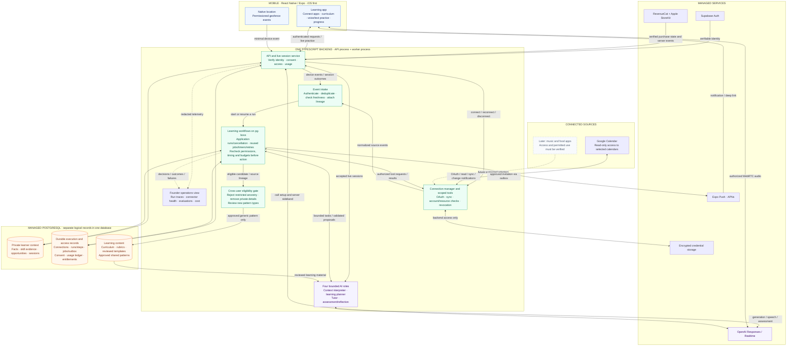

# Technical architecture — personal learning orchestrator

> Historical TypeScript MVP baseline. The active Go/Temporal service architecture is described in the repository [README](../README.md). This document is retained for design history, not deployment.

September 18, 2026 · Final MVP architecture baseline · Spanish first · iOS first

**Product:** Connect authorized app and device signals to an autonomous learning workflow. The workflow discovers opportunities, conducts accepted practice, records evidence, and changes future practice. The normal curriculum and contextual activities use the same learner record.

**Implementation status:** Design ready for implementation; this diagram does not describe an already deployed system. The [technical design specification](./technical-design-plan.md) now fixes initial stack/provider choices, voice transport, API/data contracts and acceptance gates. HappyRobot and ChatGPT inform the design; neither is a required runtime dependency.

**September 19 reuse review:** the [package review](./build-vs-buy-review.md) maps every responsibility to existing services/libraries and remaining application work. The diagram below keeps direct Calendar as the current baseline. Nango is a candidate behind C1, not an additional deployed connector path.

## System diagram

Boxes describe responsibilities. Backend boxes are modules in one codebase; database cylinders are logical groups in one PostgreSQL database. Solid arrows show principal runtime exchanges. Dotted arrows show the future connector path and telemetry. Internal repository access and provider-specific callback endpoints are condensed for readability.

Mobile controls reuse React Native Paper and RevenueCat Paywalls. EAS handles build/submission mechanics; Render hosts API/worker and Supabase hosts Postgres. Sentry and vendor dashboards cover standard diagnostics. These development/operations services are omitted from the runtime arrows.

## Deployment boundaries

| Deploy or configure | Initial responsibility |
|---|---|
| Mobile application | React Native with Expo development builds; native iOS geofences, microphone/audio, notifications, StoreKit, accessible UI. Android later needs separate platform validation. |
| API process | Authenticated HTTP endpoints plus a streaming live-session endpoint. Validate identity/ownership, authorize sessions, reserve usage, manage connections, and accept verified device/provider events. |
| Worker process | Claim due jobs; synchronize Calendar, run workflow steps, dispatch invitations, assess completed sessions, schedule later checks, and maintain eligible patterns. A scheduler wakes due work even when no new external event arrives. |
| Managed PostgreSQL | Persist private learning records, definitions' version references, runs/steps, durable jobs/outbox, grants, quotas, entitlements, reviewed content, and lineage. Use transactions, expiring leases, unique keys, and version-checked transitions. |
| Managed services | One identity provider; one AI/speech provider selected by benchmark; APNs; App Store purchase validation; encrypted credential storage; backups and monitoring on the chosen cloud. |

The tutor is a logical role callable by the live session service. It is not a slow background job for each spoken turn. Other model calls run as bounded workflow steps. The concrete build uses server-brokered OpenAI Realtime call setup, phone-to-provider WebRTC audio, and a backend sideband for tools, authoritative events and server-enforced termination. The server keeps permanent credentials private and records usage/deadlines. See the technical design for this refinement of the original backend-media-relay proposal.

Ordinary lessons start through the same API/session path and update the same evidence. External connectors are optional for that path.

## The autonomous execution path

1. **Connect once:** Maya authorizes a selected Calendar account and/or native location. Connection scopes, resource selection, proactive-help preferences, and health are stored separately.
2. **Observe:** Calendar changes trigger reconciliation. The resulting event or a permissioned device event enters validated intake with owner, source ID/version, timestamps, expiry, and usage restrictions.
3. **Plan:** A versioned workflow starts or resumes. It loads permitted private context, asks the interpreter/planner for a bounded proposal, validates the proposal, and stores an opportunity.
4. **Wait and act:** The workflow can wait until a preparation time. The worker later rechecks consent, source changes, freshness, quiet hours, notification budget, and access. Eligible delivery goes through the durable outbox.
5. **Practice:** Maya accepts the invitation or starts an ordinary lesson. The API reserves allowance and starts the tutor. Voice begins after user action. Model-requested tools pass through backend authorization before execution.
6. **Learn:** The backend validates assessment output and commits evidence once, including assistance and uncertainty. A linked future workflow checks recall or application in another context.
7. **Improve the pool:** Only eligible evidence reaches pattern extraction/review. Approved generic patterns become available to other learners. Users do not publish activities.

Calendar webhooks announce source changes; scheduled preparation and due reviews are started by the runtime's clock. A connected service does not automatically supply every useful activity signal.

## Ownership and invariants

| Responsibility | Owner and rule |
|---|---|
| Connector authorization | Connection manager binds every call to the correct learner, current grant, and selected resources. Credentials never enter model prompts, mobile bundles, or telemetry. Native events also require current device/user consent. |
| Workflow state | Orchestrator owns versioned state transitions, waits, cancellation, retries, and tool budgets. Agents return proposals; they cannot change these policies. Recheck after waits and before consequential actions. |
| Private learner memory | API/orchestrator load only the permitted context for the current role. Facts, inferred situations, self-reports, and demonstrated skills remain distinct. Roles do not have unrestricted database access. |
| Live sessions and billing | API reserves/finalizes usage atomically. The server verifies purchases and limits parallel sessions and active AI duration. The free allowance remains 25 bounded sessions across five practical milestones. |
| Tool use during practice | The live service dispatches model tool requests through the same scoped authorization path used by workflow steps. No provider/model receives broad connector credentials. |
| Duplicate and late results | Unique event/step/session keys and transactional checks prevent duplicate evidence and quota charges. Canceled or superseded runs reject late results. External notification delivery cannot promise universal exactly-once behavior. |
| Revocation and deletion | Stop future access and pending source-derived work; remove applicable context and derivatives using stored lineage. Already delivered notifications may remain visible on the device. |
| Shared learning | Check eligibility before extraction. Reject restricted connector-derived sessions in the pilot, including their summaries/derivatives. Review eligible generic patterns before publication to the internal catalog. |
| Operations | Founder sees run state, decisions, reason codes, costs, connection failures, and evaluation results. Redacted telemetry is the default; private-content inspection requires appropriate consent. |

The shared catalog is an internal learning resource. It never exposes another learner's calendar, route, recording, or verbatim conversation. Its maintenance is automatic except for operator/teacher review of new pattern types.

## Committed scope and extension boundary

- **MVP sources:** Google Calendar, native iOS geofences, and first-party curriculum/session outcomes.
- **MVP agents:** context interpreter, planner, tutor, assessment/reflection; logical roles in the same application.
- **MVP workflow engine:** versioned application functions plus durable PostgreSQL jobs, timers, and runs. No visual workflow builder is needed.
- **MVP feedback:** private evidence adaptation and an eligible shared pattern pool; foundation-model retraining is not required.
- **Future connectors:** music/food only after real signal access, data-use permission, distribution limits, and mobile behavior are verified. MCP or managed OAuth can be adopted where a concrete integration benefits.
- **Future domains:** add subject-specific skills, rubrics, and activity formats after the language product works; reuse the connection and execution machinery where it fits.

## Architecture acceptance demonstration

Connect a real account, background the app, receive an independently triggered invitation, complete practice, and observe changed evidence plus a scheduled later check. Then prove that canceling the source event or revoking the connection stops pending work, a duplicate event does not duplicate evidence/usage, a worker restart resumes correctly, and another account cannot access private context.

See the [technical roadmap](./technical-roadmap.md) for build order and the [connector/orchestration research](./connector-orchestration-research.md) for the evidence behind these choices.
