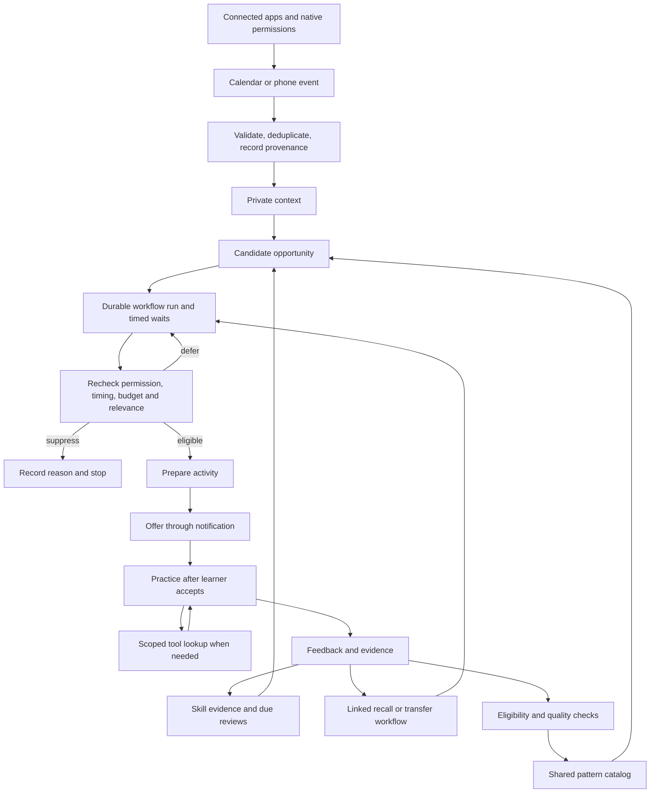

# Technical roadmap: personal learning orchestrator

> Historical TypeScript/pg-boss roadmap. Its old backend, migration, and test paths now live under `legacy/typescript-backend/`. The active Go/Temporal service map is in the repository [README](../README.md).

September 18, 2026 · Solo developer · iOS first · Spanish first

**Build handoff:** the [technical design specification](./technical-design-plan.md) supplies fixed stack choices and contracts; the [agent build plan](./agent-build-plan.md) supplies package ownership and execution order. Those implementation details supersede earlier open choices below.

**Reuse update, September 19:** follow the [build-versus-reuse review](./build-vs-buy-review.md) for each package. Reuse standard UI/build/paywall tooling, keep pg-boss for durable jobs, and resolve the Nango connector gate before production Calendar implementation. Earlier open choices below are historical planning context, not instructions to add competing platforms.

This is the implementation sequence for the [MVP specification](./mvp-plan.md) and [solo-founder launch plan](./solo-founder-launch-plan.md). It incorporates the learning-orchestrator vision: experiences drive practice; evidence drives subsequent experiences. The [connector and orchestration research](./connector-orchestration-research.md) adds ChatGPT-style connections, HappyRobot-style workflow execution, and structured context shared across a learner's agents. No application code or live integrations have been implemented as part of this roadmap.

## 1. Release definition

The first paid-capable release contains:

- An iOS app with 25 interactive session slots across five practical milestones.
- A personal skill record and a normal learning path available immediately after signup.
- Calendar and location signals that independently create practice opportunities.
- A Connect apps experience with account/resource selection, capability explanations, connection health, reconnect, and disconnect.
- Versioned workflows whose runs persist across timers, learner responses, tool calls, and follow-up practice.
- Personalized speaking/listening sessions, feedback, and delayed transfer checks.
- An automatically maintained private opportunity pool and a small shared pool of eligible activity patterns.
- Server-enforced free allowance, subscription access, privacy controls, and production diagnostics.

The acceptance demonstration is: a learner connects an account; a real external signal arrives while the app is backgrounded; a workflow waits until an eligible moment, then prepares and offers relevant practice; a learner responds; the run saves evidence and schedules a linked follow-up that changes later practice. Separately, an eligible generic pattern can be adapted for a second learner without exposing the first person's data. Cancellation, duplicate events, and connection revocation must also work.

Do not start by building a universal agent framework. Implement this learning workflow with explicit states and functions, then generalize only when a second subject provides real requirements.

## 2. Architecture and stack

See the [final technical architecture diagram](./technical-architecture.md) for deployment boundaries, principal data flows, and ownership rules.

| Layer | Initial choice | Responsibility |
|---|---|---|
| Mobile | React Native, TypeScript, Expo development builds | Screens, microphone/audio UX, native permissions, geofence handling, notifications |
| API | TypeScript with a conventional HTTP framework | Authentication checks, sessions, progress, connector setup, billing state |
| Worker | Same backend codebase, separate worker process | Sync, opportunity decisions, generation, notification dispatch, reviews |
| Database | Managed PostgreSQL | Learner state, provenance, transactions, durable jobs, usage ledger |
| Connections | Direct Calendar API plus native location initially | Per-user grants, resource selection, tool access, sync, event intake, health |
| Workflow runtime | Versioned functions plus durable runs/jobs in the same backend | Steps, waits, resumption, validated tool calls, cancellation and recovery |
| Identity | One managed authentication provider | User identity and token lifecycle; server verifies every request |
| AI/audio | One hosted provider selected through a small benchmark | Structured activity generation, conversation, transcription/audio, assessment assistance |
| Purchases | StoreKit subscriptions; optionally a managed subscription SDK/service | Purchase verification, renewal/refund events, restore purchases |
| Hosting | One cloud, selected after credit eligibility and cost review | API, worker, database, secrets, monitoring, backups |

Use SwiftUI instead if existing Swift expertise materially outweighs TypeScript familiarity; freeze that decision before implementing screens. Android is a later release using shared code, with its own native testing.

Cloud approval must not block local development. Use local Postgres and provider sandbox/test accounts first. Do not build a cloud-abstraction layer. Choose hosting by the end of week two and deploy the same backend code there.

Suggested repository layout, creating directories only as work begins:

```text
apps/mobile/          mobile UI and native integration
services/backend/     HTTP routes, workflow functions, worker
content/spanish/      versioned skills, rubrics, reviewed templates
db/migrations/        schema changes
tests/                workflow and integration checks
docs/                 decisions, setup, deployment runbook
```

## 3. Core workflow and agent responsibilities



Use four bounded AI responsibilities within one application, not four independently deployed services:

1. Context interpretation: propose a possible situation from allowed facts, with uncertainty.
2. Activity planning: select a skill, format, difficulty, and reviewed template.
3. Tutoring: conduct the accepted practice and provide focused feedback.
4. Reflection: propose evidence updates, future practice, and eligible abstract patterns.

Code owns access control, consent, quota, state transitions, clock decisions, and data-sharing eligibility. AI output cannot authorize a notification, change a subscription, or broaden connector access.

The curriculum and all four roles use the same private learner context. Keep facts, inferred situations, self-reports, and demonstrated skill evidence distinct. A role can request an allowed tool during its step; the runtime validates the call and binds it to the authenticated connection. The next role receives the necessary structured result and provenance. Long waits release the worker and model connection.

### Connection layer

Keep a small source capability record in code for Calendar and location: permitted reads/writes, supported events, sync strategy, freshness expectations, and data restrictions. Store each learner's connection separately. Native location uses OS permission rather than SaaS OAuth, while still exposing health and controls in the app.

Distinguish tool lookup, synchronized context, and event triggers. Calendar webhooks start reconciliation; your scheduler starts work before an event. A connected API does not imply a live event feed. MCP can expose tools and supported subscriptions, but cannot provide missing upstream access or replace durable execution.

The mobile Connect apps screen shows the connected account, selected resources, actual capabilities, last sync/health, and reconnect/disconnect. Access authorization and proactive-prompt preferences remain separate. New scopes require the appropriate authorization flow. Disconnect blocks tool calls and cancels pending source-derived work.

Evaluate Nango auth/proxy in the bounded C1 Calendar proof from the reuse review; direct Google remains the concrete fallback until the integration decision updates the specification. Keep application ownership/resource checks in either case. Use one production path. No connector marketplace or custom MCP server is required for the initial release.

### Definitions and runs

A workflow definition is reviewed, versioned code/prompt logic. A workflow run is one learner's execution, including trigger, current step, waits, tool results, and outcome. Start with context-to-practice and follow-up-check workflows. Keep opportunities, runs, and sessions as separate records with explicit links.

Run states: pending → running → waiting → running → completed; terminal alternatives are canceled, expired, superseded, or failed. Store the wait reason, resume event/time, and expiry. Recovery resumes from committed steps. A run may wait for the learner without keeping an AI session open; a review days later is a linked run.

## 4. Twelve-week implementation sequence

Estimates assume an experienced developer working substantially full time. Move by exit criteria rather than dates; app review and unfamiliar native work may extend the schedule. Recruit and observe users throughout.

### Phase 0 — Feasibility and decisions · Week 1

- Create repository, development/test environments, CI type checking, and secret management.
- Install a development build on a physical iPhone.
- Prove a background geofence event and a notification/deep link.
- Connect a real Google test calendar read-only and fetch a real event.
- Record the source's actual tools, event behavior, scopes, freshness, restrictions, and failure states; verify these rather than infer them from a connector label.
- Test Spanish speech quality, response latency, interruption handling, data terms, and cost using the same 20 tasks across two candidate providers; select one.
- Write a one-page decision record: platform, cloud shortlist, audio provider, auth, supported signal behavior.

**Exit:** real signals have been observed; unsupported states and delays are documented. A simulated event does not satisfy this gate. Music/food integrations remain outside the critical path because access has not been established.

### Phase 1 — First useful learning session · Week 2

- Theme and compose React Native Paper components; build learning-specific progress/audio/feedback interactions and loading/error states.
- Add signup/sign-in, learner profile, goal, approximate level, time zone, consent records.
- Implement the session player with text and bounded speaking/listening interaction.
- Create five reviewed initial activities with skill tags and assessment criteria.
- Save session state so network failure/relaunch does not lose completed work.
- Introduce the usage ledger and per-session caps now; a paywall comes later.

**Exit:** a tester signs up, completes a useful session, receives understandable feedback, and sees durable progress. Another account cannot access that session. Voice is activated only after user action.

### Phase 2 — First autonomous workflow · Weeks 3–4

- Implement Google OAuth callback/state validation, encrypted refresh-token storage, selected calendars, initial and incremental sync.
- Add watch renewal, change reconciliation, cancellation, and recovery from invalid sync tokens.
- Build Connect apps with selected resources, capability explanations, connection health, and reconnect/disconnect.
- Schedule decisions from calendar timestamps; change webhooks do not substitute for a clock.
- Implement the versioned context-to-practice workflow and durable run/step records. Prove timed wait, resume, and cancellation without a continuously running model.
- Normalize signal facts, generate a bounded opportunity, run hard gates, select a reviewed activity, and deliver its invitation.
- Add an in-app opportunities list, why-this-appeared explanation, dismiss/snooze, quiet hours, pause, and connector disconnect.
- Add structured decision traces with no raw calendar text in general logs.
- Add a founder run view: workflow version, trigger, current step/wait, suppression reason, tool status, attempts, cost, and outcome. Inspecting private content requires appropriate consent.

**Exit:** one real calendar event creates an offer without the learner declaring the activity; cancellation/revocation prevents pending delivery; retries do not multiply visible invitations. Five testers can exercise the complete loop.

### Phase 3 — Location and persistent adaptation · Weeks 5–6

- Register a small, curated set of geofences, automatically selected from area/preferences; no continuous route recording.
- Handle permissions, initial region state, repeated entry/exit, stale observations, and app lifecycle differences.
- Upload minimum context; a region event is a possible situation, not proof of entering a specific shop or speaking Spanish.
- Merge overlapping calendar/location opportunities before delivery.
- Record skill evidence separately from self-reported real-world activity.
- Schedule delayed recall and alternate-context practice with assistance levels recorded.
- Link follow-up runs to skill evidence; recheck connection health and context after waits. Reject late results for canceled or superseded runs.
- Add bounded tutor tool lookup for reviewed examples, with server-controlled learner/resource scope and a tool-call limit.

**Exit:** a real physical location test produces useful practice; an earlier difficulty changes a later task. An ignored prompt does not lower skill estimates. Failed location permissions leave structured/calendar practice available.

### Phase 4 — Complete free product and shared learning · Weeks 7–8

- Expand to five milestones and 25 adaptive session slots: two guided, two context-adapted, and one transfer check per milestone.
- Build the progress path, saved feedback, weekly recap, and clear remaining allowance.
- Implement automatic pattern extraction from explicitly eligible first-party sessions only.
- Apply provenance and private-entity checks; route novel pattern types to operator/teacher review.
- Store approved patterns and permitted aggregate outcomes; adapt a pattern for a second learner.
- Complete account deletion/export and source-derived-data removal before expanding the pilot.

**Exit:** an end-to-end TestFlight pilot works across the free experience. Learner B receives an adapted pattern without A's calendar/location details or transcript. Restricted connector-derived sessions cannot enter the shared pool.

### Phase 5 — Paid access and operations · Weeks 9–10

- Configure one monthly subscription; choose the paid voice allowance from observed costs.
- Validate purchase evidence server-side, process billing notifications idempotently, and reconcile entitlements.
- Implement renewals, expiry, refund/revocation, cancellation-at-period-end, and restoration.
- Gate session starts and active AI minutes on the server; prevent parallel sessions bypassing limits.
- Add user/provider rate limits, cost ceilings, provider timeouts, retry bounds, and operator kill switches.
- Exercise backup restoration and deployment rollback.

**Exit:** session 25 works, session 26 requires entitlement, retries do not double-charge allowance, and purchase restoration works on another device. Sandbox transactions remain separate from real revenue.

### Phase 6 — Release quality · Weeks 11–12

- Address observed retention, relevance, onboarding, and audio failures.
- Teacher-review a consented sample of assessments; uncertain speech recognition must not become confident negative feedback.
- Complete VoiceOver, contrast, text-size, caption/text alternatives, and interruption/recovery checks.
- Prepare store screenshots, description, privacy disclosures, subscription terms, review instructions, and support contact.
- Release gradually within a cost budget; analyze only cohorts old enough for the reported retention window.

**Exit:** release blockers are closed, support and rollback are ready, and operating cost per session is measured. Shipping is not evidence of learning efficacy; continue delayed transfer assessment.

## 5. Data model: build in dependency order

| Record | Essential fields and invariant |
|---|---|
| Learner/consent | User ID, language, goals, time zone, preferences, consent version and revocation time |
| Skill/template | Stable ID, prerequisites, functional objective, format, rubric, content version |
| Session/response | Owner, activity version, status, timestamps, assistance, assessment uncertainty, cost; server-owned result |
| Usage ledger | Session reservation/finalization/release and consumed duration; unique session key; atomic updates |
| Skill evidence | Source session, observed response, skill, result, assistance, next review; preserve evidence history |
| Connection | Owner, provider/native source, stable provider account ID where available, scopes, selected resources, encrypted secret reference, cursor, watch expiry, health |
| Context event | Owner, provider event/version, observed/received times, expiry, permitted facts, provenance restrictions |
| Opportunity | Owner, context lineage, target skill, template, valid window, state, suppression reason |
| Workflow run | Owner, definition/version, trigger/parent run, opportunity/session links, state, current step, wait condition, due/expiry time, lineage, cancellation reason, concurrency version |
| Step result | Run and step key, attempt/status, permitted input/output references, model/prompt version, tool result, duration/cost, error code; unique committed result per logical step |
| Job/outbox | Unique task key, due time, attempts, lease, state, payload reference; bounded retries |
| Shared pattern | Generic structure, allowed provenance, quality status, version, eligible aggregate evidence |
| Entitlement | Verified provider transaction lineage, product, expiry/revocation, last reconciliation |

Use foreign keys and uniqueness constraints for ownership links and idempotency. Enforce tenant access in the API and database where supported. Never let the client assert an arbitrary user ID or assessment result.

Derived content retains its provenance. Deletion or connector revocation must find associated scheduled work and private derivatives. Restricted ancestry remains restricted after summarization or name removal.

## 6. Minimal API and job contracts

These are proposed contracts, not a required framework or a code scaffold.

| Operation | Behavior |
|---|---|
| Get/update learner | Return or update only the authenticated learner's permitted profile/preferences |
| List opportunities | Return current eligible/private offers; expired offers never imply current context |
| Start session | Validate activity access and entitlement; reserve allowance in a transaction; require idempotency key |
| Submit response/finish session | Persist once, validate ownership, produce assessment, finalize usage, enqueue follow-up |
| Ingest device event | Verify identity, event shape, source/time bounds, consent and rate limits; accept no arbitrary instructions |
| List connection status | Return this learner's accounts/resources, real capabilities, grant state and freshness; never return credentials |
| Connect/disconnect calendar | OAuth with state binding; minimum scopes; revoke/cancel and remove applicable data on disconnect |
| Execute scoped tool internally | Bind connection and owner server-side; enforce current grants/resources, schema, lineage and budgets; return structured minimal results |
| Resume workflow internally | Validate expected state/version and triggering event; claim due step once; discard stale/canceled results |
| Calendar webhook | Verify channel identity/token; enqueue sync; do not trust incoming text as event facts |
| Billing webhook/reconcile | Verify provider authenticity and transaction state; update entitlement idempotently |
| Export/delete account | Reauthenticate as needed; stop jobs and connectors, remove owned data, track completion |

Jobs: sync calendar, renew watch, resume due run, decide opportunity, generate activity, dispatch offer, assess session, schedule review, extract eligible pattern, reconcile billing, delete expired data. Use one durable queue; workflow steps reuse these functions. Split services only when measured throughput or ownership requires it.

## 7. State, timing, and failure rules

Opportunity states: candidate → eligible → scheduled → offered → started → completed, with deferred/suppressed/canceled/expired/failed alternatives.

- Recheck consent, context expiry, entitlement where relevant, quiet time, and notification budget immediately before dispatch.
- Recheck grants and allowed resources on every tool call and after waits. Never put refresh tokens in model context.
- Use expiring job leases and transactional/version-checked run transitions; duplicate or out-of-order events cannot rewind a run. Check current run state before committing late model/tool results.
- Cancel or supersede pending runs when their source changes. Preserve past session evidence subject to source restrictions and deletion requirements.
- Bound model/tool calls and retries per run. Record attempt failures separately from committed results; use provider idempotency keys for side effects where supported.
- Start with two proactive prompts per local day and a three-hour cooldown; these are tunable hypotheses.
- Record delivery attempts separately from observable receipt/open. OS delivery is not guaranteed.
- Use stable notification IDs and client deduplication; do not claim exactly-once delivery across external systems.
- If context or generation fails, remain quiet or offer an explicitly context-independent lesson. Never invent an observed event.
- Use a cached activity only within its valid scope; personal content cannot be shared through a global cache.
- Pin prompt/content versions to sessions. Reverting a bad prompt must stop future generation while preserving past evidence.
- Pin workflow versions to runs. Stop affected pending work on a bad-version rollback; migrate or replace it explicitly rather than silently switching its logic.
- Low-confidence transcription leads to clarification or an uncertain assessment, not fabricated proficiency judgments.

## 8. Free allowance and subscriptions

Twenty-five session slots are lifetime free access, not a monthly reset. Cap each at three active AI minutes; the full allowance is at most 75 minutes. Keep a separate counter for completion/mastery: consuming a session slot does not demonstrate learning.

Reserve a slot at start; finalize when useful interaction has been delivered. Define a concrete delivery milestone in the session runtime, such as successfully delivering the first interactive prompt and accepting the learner's response. Technical failures before that point release the reservation. Resumes use the same ID and remaining time. Apply short reservation expiry and server-side reconciliation for crashed clients; provisional usage is still capped to prevent repeated-abandon abuse.

After free access ends, preserve results, cached reviews, and privacy/account functions. Do not create paid-only contextual notifications that look freely actionable without clearly indicating access requirements. Support ordinary practice when connectors are declined.

## 9. Test and release checklist

Keep tests focused on invariants and failure paths:

- Cross-account session/opportunity access is denied.
- Two simultaneous session starts cannot overspend the allowance.
- Duplicate response, webhook, queue retry, and billing event do not duplicate evidence or usage.
- Calendar edit/cancel, stale event, time-zone change, quiet hours, and consent revocation cancel or reschedule correctly.
- A workflow resumes after worker restart without duplicate evidence/usage; expired leases recover; two workers cannot commit conflicting steps.
- Revocation during a wait or in-flight model call blocks subsequent tools/dispatch; late results cannot revive canceled work.
- A tool call with another learner's connection or unselected resource is denied; reconnect does not change account ownership.
- A prompt-injection string in an event title cannot change permissions or trigger tools.
- Restricted context never enters shared extraction, general analytics, or cross-user caches.
- Session interruptions and provider timeouts preserve usable progress and correct allowance.
- Account deletion stops queued work and removes appropriate derivatives.
- On real iPhones: foreground/background, locked screen, reboot/unlock, network loss, permission denial/revocation, low-power mode, and force termination. Document each observed limitation rather than assume identical behavior.
- Purchases: initial buy, renew, expire, refund, restore, delayed webhook, and account/device changes.

Initial performance targets for pilot measurement—not provider guarantees: normal screen transitions remain responsive; prepared activities open in roughly two seconds; typical voice turns respond within roughly three seconds on a normal network. Record p50/p95, not only the best demo. Source-to-notification latency is measured separately from backend latency.

Observe signup, first session, first autonomous session, completion, due review, milestone progression, free exhaustion, paywall, conversion, and renewal. Log IDs and reason codes rather than private content. Track direct cost per session and per active learner, crash/error rates, connector health, false-context reports, and notification opt-outs.

Use a small versioned evaluation set for context inference, appropriate suppression, allowed tool selection, activity quality, and assessment accuracy. Compare AI assessment with teacher judgment on a consented sample. Track later unassisted recall separately from engagement and notification delivery. The founder run view should explain why the system acted, deferred, or failed without exposing private source text by default.

## 10. Extension path

**After stable iOS usage:** Android QA, native lifecycle work, and billing setup. Verify each promised connector separately.

**After evidence of useful contextual practice:** increase location coverage and add one supported connector at a time. Music needs both accessible signals and permitted content/data use.

**After language-learning retention and economics are credible:** add a second language or subject. Introduce subject-specific skill maps, activity formats, prerequisites, and rubrics. Reuse context intake, permissions, scheduling, sessions, and evidence storage only where they actually fit.

**Only after two domains establish common requirements:** extract a reusable learning-orchestration layer. Other life workflows are a longer-term exploration, not a dependency of the language app.

## First sprint, ready to start

1. Create the mobile/backend repository and get a signed development build onto an iPhone.
2. Prove one background geofence event and notification deep link.
3. Fetch a real read-only calendar event and normalize it into a timestamped context record.
4. Build one reviewed speaking/listening activity and persist its result securely.
5. Connect the signal to that activity through a versioned workflow run that can wait, resume, and cancel.

**Sprint demonstration:** leave the app, let a real signal arrive, observe the run wait/resume, receive an invitation, complete the activity, and see the resulting skill evidence and scheduled next check. Inspect the run's decision history. That is the smallest technical proof of the company's central idea.
